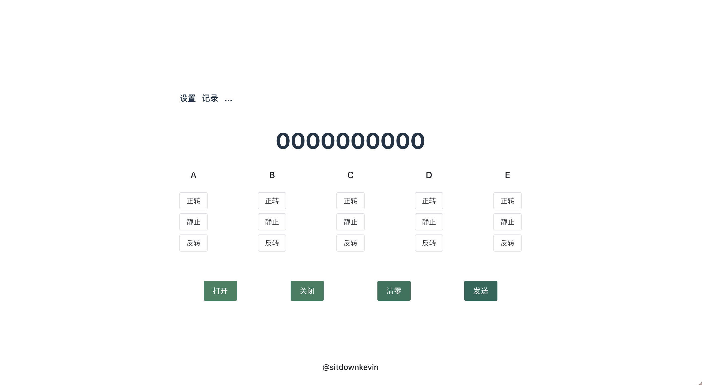

<div align=center>


# Simple Robotic Hand Control

##### *THIS IS A VERY PERSONALIZED PROJECT, MAYBE NOT HELPFUL TO YOU*
##### WEB PAGE DEMO OF A CONTROL PANEL: https://robatic-control.pages.dev/

</div>

---
## Introduction

This is a light project for **College Students' Innovation and Entrepreneurship Competition**. The procedures are designed for controlling a 3D printed robotic hand build by our team.

This repository includes three parts. 

1. **C++ files**: In the directory *forUNO*. Those files are for Arduino UNO, and to be flashed into Arduino Uno board.
2. **Server**: There are two main connections in the Server. The first one is the connection between Arduino UNO and the Server through *Port connection* based on [`PySerial`](https://pyserial.readthedocs.io/en/latest/index.html) module. The second one is the connection between the Server and the Control Panel (a Web Page) through *WebSocket protocol* using [`websockets`](https://websockets.readthedocs.io/en/stable/) module. 
3. **Control Panel**: A simple Web Page powered by [`Vue.js`](https://vuejs.org/). Its UI is based on [`Naive UI`](https://www.naiveui.com/zh-CN/os-theme).

## How to Use

### **Preparation**
Flash C++ procedures into Arduino UNO board. Use the Arduino-IDE to flash the *forUNO.ino* file into the board
### **Start the Server**
Run the Python files. Adjust the configurations (Port, BaudRate, etc.) in `config.py`. Then run the command
```python
python main.py
```
### **Open the Control Panel** 
Open the *front-end-vite* directory in the Terminal, then run the following command.
```
npm install

npx vite
```
*Notice: `node.js` environment is needed*

Then, the local Control Panel is ready to be accessed
<div align=center>
    </img>
    <p>Control Panel</p>
    
</div>

## Current Functions
### **Robotic Hand Control**
Now we have managed to control each finger of the robotic hand in one dimensions. This process is smooth and robust due to the great performance of Arduino board and fast information transimission ability of Serial communication and WebSocket protocol. 

In the future, we will embed recored command streams into the front-end to offer more demos.
### **Connections between Parts**
Now we relies on Serial communication and WebSocket protocol due to limited financial support and skills. In fact, it is possible to replace the server in a PC with a built-in server in the Arduino board. In this way, the communication time will be greatly reduced and the connection will be wireless. 

In the future, we will add a wireless module which suppports WebSockets protocal into the motherboard. All command will be through this module and directly send to the Arduino UNO instead of through a PC server. 
